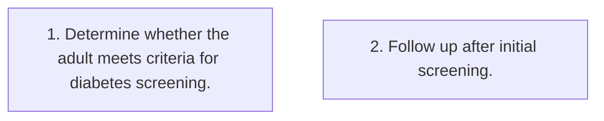

# Care Pathway — Diabetes Screening Care Pathway

**Clinical Question**: What screening steps should happen for an adult who meets the ADA diabetes screening criteria?

## Steps

| Step | Description | Actor | Next |
|------|-------------|-------|------|
| 1 | Determine whether the adult meets criteria for diabetes screening. |  |  |
| 2 | Follow up after initial screening. |  |  |

## Clinical Pathway Diagram

